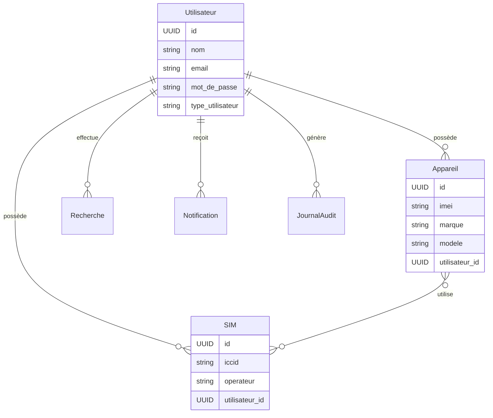

"# 🇫🇷 Projet EIR Francisé - Système de Gestion des IMEI

> **Version francisée complète** avec API entièrement traduite en français et interface de gestion intuitive.

## 🌟 Caractéristiques Principales

- ✅ **API 100% francisée** : Tous les endpoints, messages et erreurs en français
- ✅ **Support multilingue** : Français (par défaut), Anglais, Arabe
- ✅ **Interface de gestion intuitive** avec scripts automatisés
- ✅ **Architecture Docker** pour un déploiement simplifié
- ✅ **Documentation interactive** Swagger en français
- ✅ **Base de données PostgreSQL** avec données de test
- ✅ **Système d'audit complet** pour traçabilité
- ✅ **Gestion des permissions granulaires**

## 🚀 Démarrage Ultra-Rapide

### Option 1 : Lancement Automatique
```bash
./quick-start.sh
```

### Option 2 : Script de Gestion Interactif
```bash
./scripts/manage-eir.sh
```

C'est tout ! 🎉 L'application sera accessible sur http://localhost:8000

## 📋 Menu de Gestion Complet

Le script `manage-eir.sh` offre un menu interactif avec :

### 🔄 Gestion des Conteneurs
- **Reconstruction complète** : Build et déploiement depuis zéro
- **Redémarrage intelligent** : Redémarrage rapide avec conservation des données
- **Gestion par service** : Web ou base de données individuellement

### 🗄️ Gestion de la Base de Données
- **Reconstruction complète** : Nouveau schéma avec données de test
- **Réinitialisation rapide** : Conservation du schéma, nouvelles données
- **Sauvegarde/Restauration** : Protection et récupération des données

### 📊 Monitoring et Tests
- **Statut des services** : Vue d'ensemble de l'état du système
- **Tests API francisée** : Validation des endpoints français
- **Consultation des logs** : Debugging facilité

### 🛠️ Utilitaires
- **Nettoyage Docker** : Libération d'espace disque
- **Gestion des sauvegardes** : Archivage et restauration

## 🏗️ Architecture du Projet

```
eir-project/
├── 🚀 quick-start.sh           # Démarrage automatique
├── 🔧 scripts/                 # Suite complète de gestion
│   ├── manage-eir.sh           # Script principal interactif
│   ├── rebuild-containers.sh   # Reconstruction des conteneurs
│   ├── restart-containers.sh   # Redémarrage des services
│   ├── rebuild-database.sh     # Reconstruction de la DB
│   └── reset-database.sh       # Réinitialisation des données
├── 📦 backend/                 # API FastAPI francisée
│   ├── app/
│   │   ├── main.py            # Point d'entrée principal
│   │   ├── api/               # Endpoints API francisés
│   │   ├── models/            # Modèles SQLAlchemy
│   │   ├── schemas/           # Schémas Pydantic
│   │   ├── core/              # Configuration et authentification
│   │   ├── i18n/              # Système de traduction
│   │   └── services/          # Logique métier
│   ├── Dockerfile
│   └── requirements.txt
├── 🐳 docker compose.yml       # Configuration multi-services
├── 📚 docs/                    # Documentation technique
└── 📖 README.md               # Ce fichier
```

## 🌐 Endpoints API Francisés

### 🏠 Points d'Accès Principaux
- **Documentation interactive** : `http://localhost:8000/docs`
- **Santé du système** : `http://localhost:8000/verification-etat`
- **Langues supportées** : `http://localhost:8000/langues`
- **Page d'accueil** : `http://localhost:8000/`

### 📱 Gestion des IMEI
- `GET /imei/{imei}` - Recherche d'un IMEI spécifique
- `POST /imei/recherche-avancee` - Recherche avec filtres
- `POST /imei/enregistrer` - Enregistrement d'un nouvel appareil

### 👤 Gestion des Utilisateurs
- `POST /utilisateurs/creer` - Création d'utilisateur
- `GET /utilisateurs/profil` - Profil utilisateur connecté
- `PUT /utilisateurs/modifier` - Modification du profil

### 🔐 Authentification
- `POST /auth/connexion` - Connexion utilisateur
- `POST /auth/deconnexion` - Déconnexion
- `POST /auth/renouveler-token` - Renouvellement du token

## 🗃️ Base de Données

### Structure Principale


### Données de Test Intégrées
- **Utilisateurs administrateurs** avec permissions complètes
- **Appareils d'exemple** avec IMEIs valides
- **Cartes SIM de test** de différents opérateurs
- **Historique d'audit** pour démonstration

## 🔧 Configuration Avancée

### Variables d'Environnement
```bash
# Base de données
POSTGRES_DB=eir_project
POSTGRES_USER=postgres
POSTGRES_PASSWORD=motdepasse_securise

# API
API_SECRET_KEY=cle_secrete_jwt
API_ALGORITHM=HS256
API_ACCESS_TOKEN_EXPIRE_MINUTES=30

# Multilingue
DEFAULT_LANGUAGE=fr
SUPPORTED_LANGUAGES=fr,en,ar
```

### Personnalisation des Scripts
Tous les scripts peuvent être personnalisés via des options :

```bash
# Reconstruction avec données personnalisées
./scripts/rebuild-database.sh --custom-data

# Redémarrage en mode verbose
./scripts/restart-containers.sh --verbose

# Sauvegarde avec compression
./scripts/manage-eir.sh  # Option 10 dans le menu
```

## 🐛 Dépannage Rapide

### Problèmes Courants

#### 🚫 Docker non démarré
```bash
sudo systemctl start docker
# Ou démarrer Docker Desktop
```

#### 🔒 Ports occupés
```bash
sudo netstat -tulpn | grep :8000
sudo kill -9 <PID_DU_PROCESSUS>
```

#### 💾 Base de données corrompue
```bash
./scripts/rebuild-database.sh
```

#### 🔄 Conteneurs qui ne répondent pas
```bash
./scripts/rebuild-containers.sh
```

### Logs de Debug
```bash
# Via le menu principal
./scripts/manage-eir.sh  # Option 8

# Ou directement
docker compose logs -f
```

## 📊 Fonctionnalités Techniques

### 🛡️ Sécurité
- **Authentification JWT** avec expiration automatique
- **Hashage bcrypt** des mots de passe
- **Permissions granulaires** par utilisateur
- **Validation stricte** des données d'entrée
- **Protection CORS** configurée

### 🌍 Internationalisation
- **Support multilingue** automatique
- **Détection de langue** via headers HTTP
- **Messages d'erreur traduits** dans toutes les langues
- **Format de dates localisé**

### 📈 Performance
- **Pool de connexions** à la base de données
- **Cache des traductions** en mémoire
- **Validation asynchrone** des requêtes
- **Compression gzip** automatique

### 📝 Audit et Logging
- **Traçabilité complète** des actions utilisateur
- **Logs structurés** en JSON
- **Rotation automatique** des fichiers de log
- **Alertes temps réel** pour les erreurs critiques

## 🔗 Documentation Complémentaire

- **[📁 Scripts de Gestion](scripts/README.md)** - Guide détaillé des scripts
- **[🔐 Guide d'Accès Granulaire](docs/GRANULAR_ACCESS_GUIDE.md)** - Configuration des permissions
- **[📋 Cahier des Charges](docs/cahier_de_charges_eir.tex)** - Spécifications complètes
- **[🏗️ Diagrammes UML](docs/uml/)** - Architecture système

## 🆘 Support et Contribution

### 🐛 Signaler un Bug
1. Consulter les logs : `./scripts/manage-eir.sh` (option 8)
2. Vérifier le statut : `./scripts/manage-eir.sh` (option 6)
3. Reproduire l'erreur en mode verbose

### 🔧 Développement Local
```bash
# Environnement de développement
git clone <votre-repo>
cd eir-project
./quick-start.sh

# Tests de l'API
curl http://localhost:8000/verification-etat
```

### 📞 Contact
- **Documentation** : Consultez les fichiers dans `/docs/`
- **Scripts** : Guide détaillé dans `/scripts/README.md`
- **Architecture** : Diagrammes UML dans `/docs/uml/`

---

**🎯 Objectif** : Fournir un système EIR complet, francisé et prêt pour la production avec une interface de gestion intuitive.

**✨ Innovation** : Premier système EIR entièrement francisé avec scripts de gestion automatisés et interface multilingue.